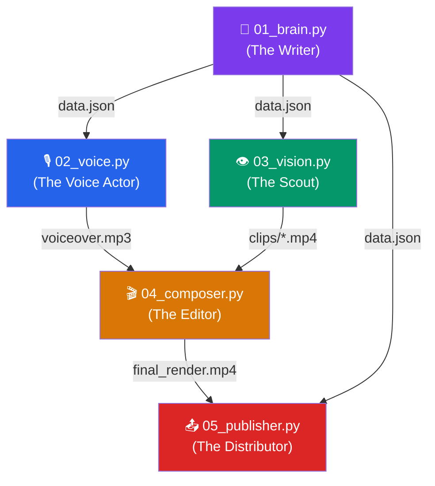
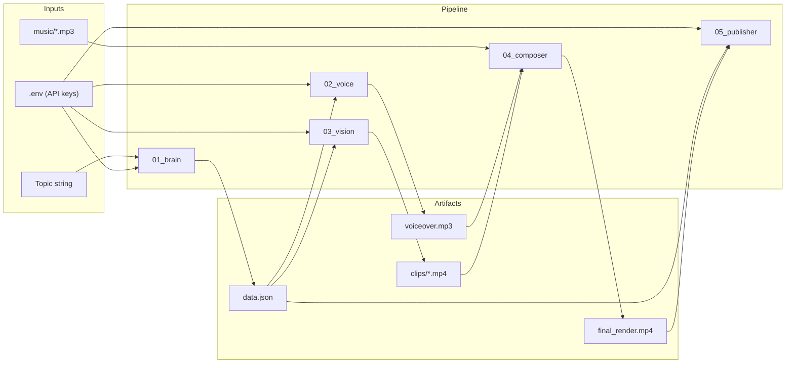
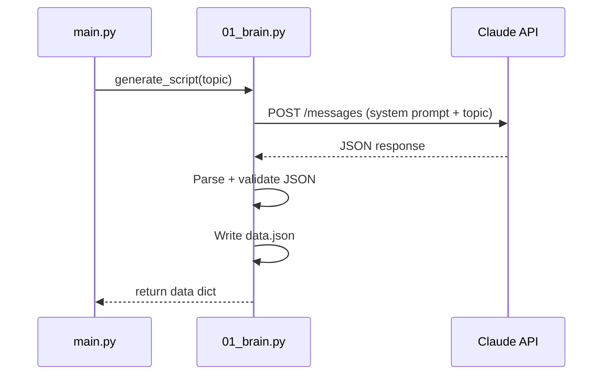
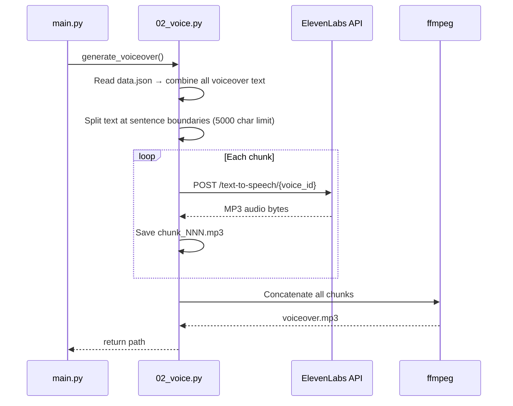
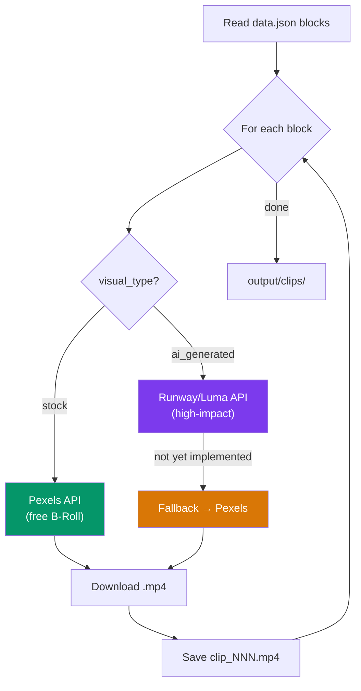
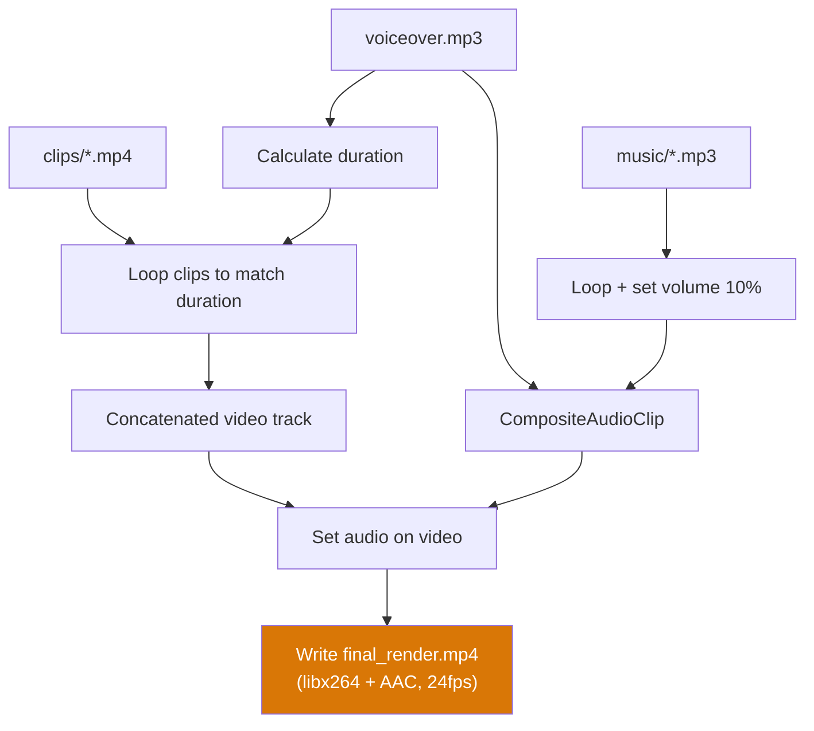
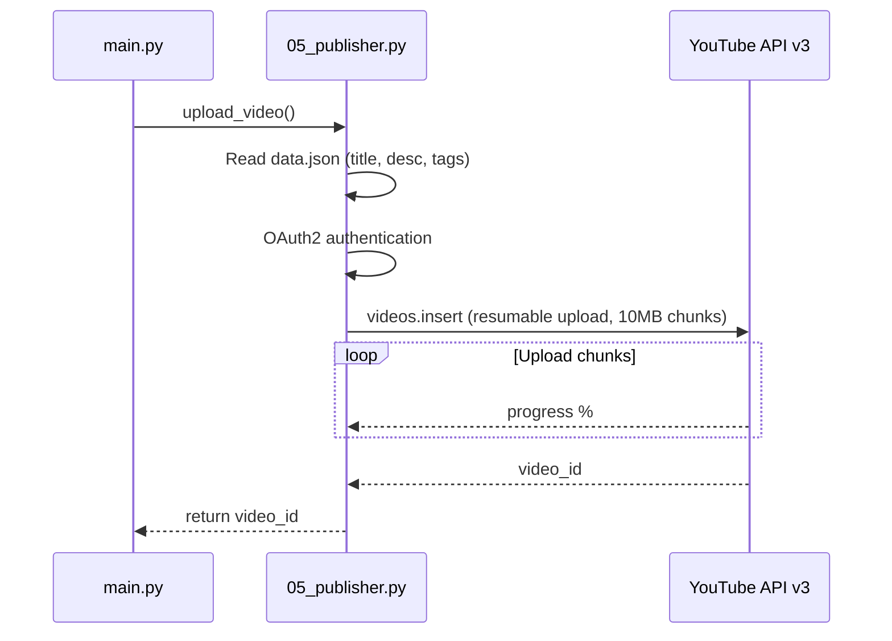
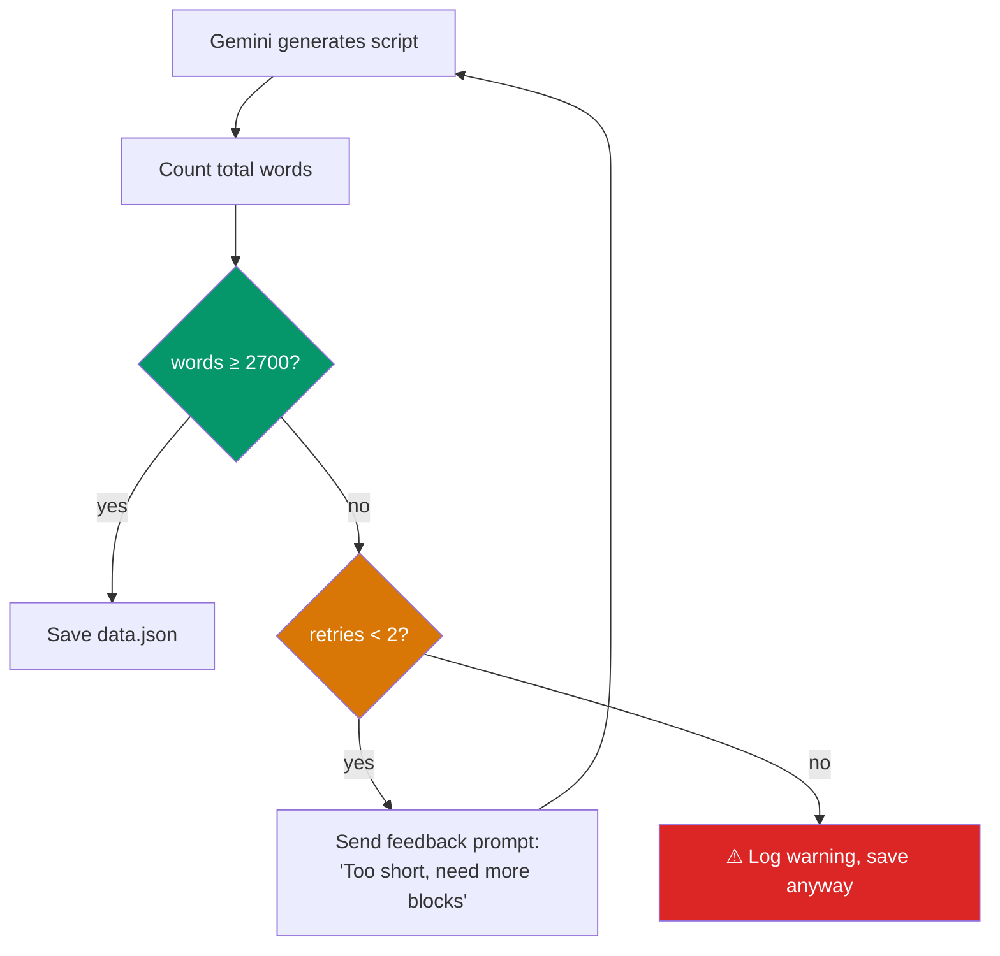

# 🎬 AI Video Generator — Walkthrough

## Overview

Automated pipeline that generates 20-minute YouTube escapism documentaries. Five scripts execute sequentially, each producing an artifact consumed by the next.

---

## Pipeline Flow



---

## Data Flow & Artifacts



---

## Step-by-Step Breakdown

### Step 1 — `01_brain.py` (The Writer)



**Input:** Topic string (e.g., `"Europa's Hidden Ocean"`)

**Output:** `output/data.json`
```json
{
  "title": "...",
  "description": "...",
  "tags": ["space", "europa", "..."],
  "synthetic_content_label": true,
  "blocks": [
    {
      "block_id": 1,
      "voiceover": "Narration text...",
      "visual_prompt": "Visual description...",
      "visual_type": "stock | ai_generated",
      "duration_hint_sec": 15
    }
  ]
}
```

**Key:** System prompt enforces YouTube compliance (no clickbait, narrative arc, scientific rigor).

---

### Step 2 — `02_voice.py` (The Voice Actor)



**Input:** `data.json`

**Output:** `output/voiceover.mp3`

**Key:** ElevenLabs has ~5000 char/request limit → text split at sentence boundaries → chunks concatenated via ffmpeg.

---

### Step 3 — `03_vision.py` (The Scout/Generator)



**Input:** `data.json`

**Output:** `output/clips/clip_001.mp4`, `clip_002.mp4`, ...

**Key:** Hybrid sourcing → stock for general context (galaxies, labs), AI only for high-impact moments. Cuts cost ~70%.

---

### Step 4 — `04_composer.py` (The Editor)



**Input:** `voiceover.mp3` + `clips/*.mp4` + `music/*.mp3`

**Output:** `output/final_render.mp4`

**Key:** MoviePy sequences clips, loops if not enough to fill voiceover duration. Background music at 10% volume.

---

### Step 5 — `05_publisher.py` (The Distributor)



**Input:** `final_render.mp4` + `data.json`

**Output:** Video uploaded to YouTube (private by default)

**Key:** Uploads as **private** → manual review before public. Console reminder to mark "Synthetic Content" in YouTube Studio.

---

## Running the Pipeline

```bash
# 1. Setup
cd youtube_bot
cp .env.example .env     # fill API keys
pip install -r requirements.txt

# 2. Drop ambient music
#    Place .mp3/.wav files in music/

# 3. Run (without upload)
python main.py "Europa's Hidden Ocean" --no-upload

# 4. Run (full pipeline with upload)
python main.py "Europa's Hidden Ocean"
```

---

## Architecture Decisions

| Decision | Rationale |
|----------|-----------|
| Sequential execution | Each step depends on previous output |
| `importlib` in main.py | Numeric-prefixed filenames can't be imported normally |
| Sentence-boundary chunking | Avoids cutting words mid-sentence for TTS |
| Hybrid video sourcing | AI video only where needed → 70% cost reduction |
| Local music library | Avoids Content ID strikes vs AI-generated music |
| Private upload default | Human review before public — YouTube compliance |
| `data.json` as central artifact | Single source of truth for metadata across all steps |

---

## Known Issues & Fixes

### ⏱️ Video Duration Too Short (8 min instead of 20 min)

**Root cause:** `01_brain.py` system prompt said "20 minutes" but gave no enforceable word/block constraints. LLM generated ~15-20 blocks × short voiceovers → ~8 min.

**Fix (implemented — see spec.md §6):**



**Changes required:**

| File | Change |
|------|--------|
| `config.py` | Add `TARGET_NARRATION_WORDS=3000`, `MIN_NARRATION_WORDS=2700`, `MAX_BRAIN_RETRIES=2` |
| `01_brain.py` | Rewrite system prompt: explicit word budget (3000-3200 words, 60-80 blocks, 40-50 words/block) + narrative structure skeleton (Hook/Act1/Act2/Act3/Outro) |
| `01_brain.py` | Add validation loop: count words → retry if < 2700 → max 2 retries |
| `01_brain.py` | Add post-gen stats: block count, word count, estimated duration |

## 7. Model Architecture & Workflow JSON Rewiring

**Root cause:** The user's original `47d245c34a7d.json` workflow was designed for the leaked/unreleased `ltx-2.3-22b` which featured **native audio generation** and used a **Gemma 3 text encoder**. However, the officially released public model is `ltxv-13b-0.9.8`, which is **video-only** and uses a **T5-XXL text encoder**. 
This caused a cascade of workflow crashes when `03_vision.py` submitted jobs to ComfyUI:
1. `AttributeError: 'Linear' object has no attribute 'weight'` when the custom nodes (`TextGenerateLTX2Prompt` and `LTXAVTextEncoderLoader`) attempted to load the `fp4_mixed` Gemma 3 models.
2. `Audio VAE config is required` when `LTXVAudioVAELoader` attempted to load audio configurations from the video-only `ltxv-13b` model.

**Fix (implemented):**
1. **Removed Audio Generation:** Stripped out `LTXVAudioVAELoader`, `LTXVAudioVAEDecode`, `LTXVEmptyLatentAudio`, and the A/V Latent Concatenation/Separation nodes entirely. Rewired the `video_latent` directly from the video sampler to the VAE Decoder and upsampler.
2. **Replaced Text Encoder:** Replaced the proprietary `LTXAVTextEncoderLoader` with the standard ComfyUI `CLIPLoader` node, configured to load the `t5xxl_fp8_e4m3fn.safetensors` model specifically for the `ltxv` architecture type.
3. **Bypassed Auto-Enhancer:** Removed the buggy `TextGenerateLTX2Prompt` node which crashed on FP4 weights, routing the Gemini prompt directly into the standard `CLIPTextEncode` node.
4. **Corrected Prompt Injection:** Updated `.env` to set `COMFYUI_PROMPT_NODE=267:266` so that `03_vision.py` correctly injects the unique prompt for each clip, instead of reusing the default placeholder.
5. **Fixed Path Placement:** Moved the `ltxv-spatial-upscaler-0.9.8.safetensors` from `models/upscale_models` to `models/latent_upscale_models` where the `LatentUpscaleModelLoader` node expects it.

The pipeline successfully submits and polls ComfyUI without errors, correctly generating text-to-video for each block using `LTXV-13B`.
